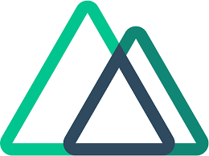

# EurocCredit Landing Page

### Table of Contents

- [Prerequisites](#Prerequisites)
- [Tech Stack](#Tech-Stack)
- [Getting Started](#Getting-Started)
- [Project Structure](#Project-Structure)
- [Deployment](#Deployment)
- [Author](#Author)

#

### Prerequisites

-  _npm @8 and up_
-  _typescript @4.9.3_

#

### Tech Stack

-  _Nuxt @3.12.2 - full-stack framework_
-  _TailwindCSS @5.3.6 - library for styling_
- _I18n @8.3.1 - library for switching languages_

#

### Getting Started

1. First of all you need to clone app repository from github:

```
git clone git@github.com:beqa200/eurocredit-landing-nuxt.git
```

2. Next step requires install all the dependencies.

```
npm install
```

3. To see project in action

```
npm run dev
```

#

### Project Structure

```

- assets
- components # reusable components
|--- layouts
|    |--- default.vue
|--- locales
|    |--- en.json
|    |--- ka.json
- pages
|--- assets
|   |---tailwind.css
- public # images
- package.json     # dependency manager configurations

```

#

### Deployment

Before every deployment you need to create build file.

```
npm run build
```

after this you can use this file to deploy project on server.

#

### Author

- [LinkedIn](https://www.linkedin.com/in/beka-maisuradze-76a730234/)
